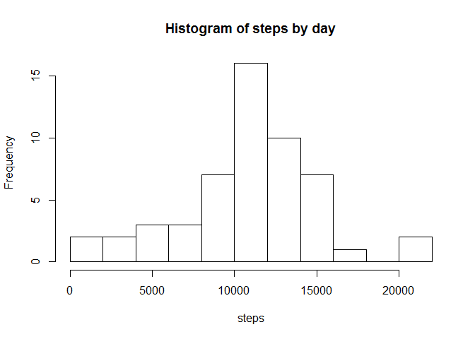
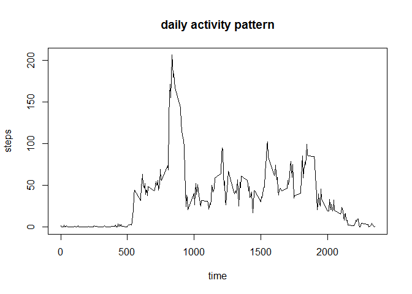
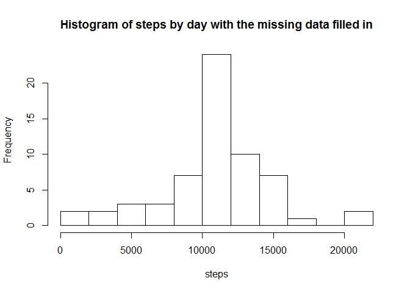
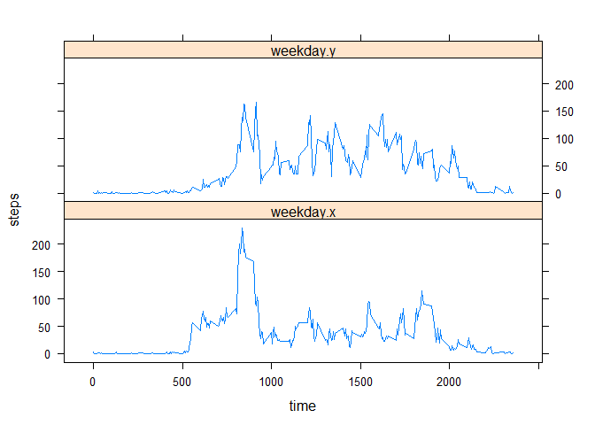

# Reproducible Research: Peer Assessment 1
## 1.Loading and preprocessing the data


```r
setwd("C:/sources/ReproducibleResearch")
getwd()
```

```
## [1] "C:/sources/ReproducibleResearch"
```

```r
actDT<-read.csv("activity.csv")
```
## 2.What is mean total number of steps taken per day?
###2-1  Histogram of the total number of steps taken each day

```r
library(dplyr)
```

```
## 
## Attaching package: 'dplyr'
## 
## The following object is masked from 'package:stats':
## 
##     filter
## 
## The following objects are masked from 'package:base':
## 
##     intersect, setdiff, setequal, union
```

```r
steps.byday<-actDT %>%
    group_by(date) %>%
    summarise(total.steps=sum(steps))
    
hist(steps.byday$total.steps,breaks=10,xlab = "steps", main = "Histogram of steps by day" )
```

 

###2-2 Mean and median total number of steps taken per day

```r
mean(steps.byday$total.steps, na.rm = TRUE)
```

```
## [1] 10766.19
```

```r
median(steps.byday$total.steps, na.rm = TRUE)
```

```
## [1] 10765
```

## 3. What is the average daily activity pattern?
###3-1 Time series plot of the 5-minute interval (x-axis) and the average number of steps taken, averaged across all days (y-axis)

```r
t_series<- actDT %>%
    group_by(interval) %>%
    summarize(tstep=mean(steps, na.rm = TRUE))

plot(t_series, type = "l", xlab = "time", ylab = "steps", main = "daily activity pattern")
```

 

###3-2 Which 5-minute interval, on average across all the days in the dataset, contains the maximum number of steps?

```r
t_series$interval[which.max(t_series$tstep)]
```

```
## [1] 835
```
 8:35 - 8:40 contains the maximum number of steps
 
## 4. Inputing missing values

###4-1 Total number of missing values 

```r
sum(is.na(actDT$steps))
```

```
## [1] 2304
```

###4-2 & 3 strategy for filling in all of the missing values
Fill the mean for that 5-minute interval.
Create a new dataset newDT that is equal to the original dataset but with the missing data filled in.

```r
na_data <- is.na(actDT$steps)
newDT <- actDT
newDT$ave <- t_series$tstep # add mean data col
newDT[na_data,]$steps<-newDT[na_data,]$ave

new_steps.byday <- newDT %>%
    group_by(date) %>%
    summarise(new_total.steps = sum(steps))

hist(new_steps.byday$new_total.steps, breaks=10,xlab = "steps", main = "Histogram of steps by day with the missing data filled in")
```

 

Histgram is almost same as the one without filling.

###4-4 Mean and median total number of steps taken per day

```r
mean(new_steps.byday$new_total.steps)
```

```
## [1] 10766.19
```

```r
median(new_steps.byday$new_total.steps)
```

```
## [1] 10766.19
```
Mean value without filling is 10766.19 and median is 10765.
Mean value with filling is same as the value without filling.
Median value with filling changed about 1 steps. But this is minor
change compared to the median value itself.

## 5. Are there differences in activity patterns between weekdays and weekends?

```r
Sys.setlocale("LC_ALL","C") # turn off locale-specific sorting
```

```
## [1] "C"
```

```r
newDT$wkd <- factor(chron::is.weekend(as.Date(newDT$date))+1L, levels=1:2, labels = c("weekday", "weekend"))

t_wkday <- newDT %>%
    filter(wkd =="weekday") %>%
    group_by(interval) %>%
    summarise(weekday = mean(steps, na.rm = TRUE))

t_wkend <- newDT %>%
    filter(wkd =="weekend") %>%
    group_by(interval) %>%
    summarise(weekday = mean(steps, na.rm = TRUE))

t_all<-merge(t_wkday,t_wkend, by ="interval")

library(reshape2)
t2_all<-melt(t_all, id="interval")
names(t2_all)=c("time","wkd","steps")

library(lattice)
xyplot(steps~time|wkd,data=t2_all, type="l", layout=c(1,2))
```

 

```r
Sys.getlocale() # resume original locale setting
```

```
## [1] "C"
```

There are differences in activity patterns between weekdays and weekend.
On weekdays there are big peak around 8:30 in the morning. But on week end the peak is suppressed and becomes same peak level in afternoon.
Another different point is that there are steep increase at around 5:00am on weekday's steps, but on weekend they gradually increase from 5:00 to 6:00am.
